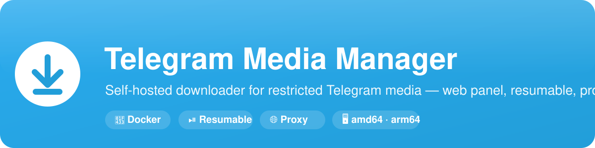
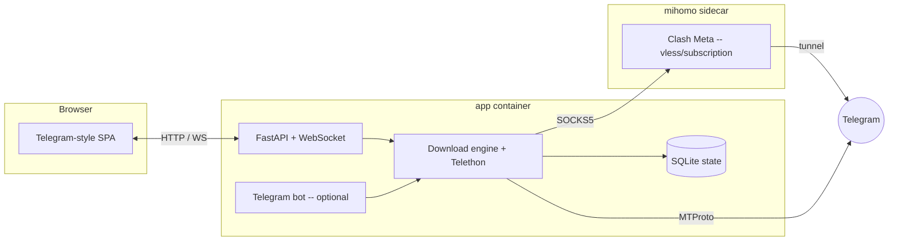

<div align="center">



<h1>Telegram Media Manager</h1>

**Self-hosted downloader for restricted Telegram media — with a Telegram-style web panel.**
Deploy to a NAS in one command, configure everything in the browser, and never lose a download to a dropped connection or a restart.

[](LICENSE)
[](https://hub.docker.com/r/gloridust/telegrammediamanager)
[](docker/Dockerfile)
[](requirements.txt)

**English** · [简体中文](README.zh-CN.md)

</div>

---

## Why

Downloading media from restricted Telegram channels normally means running a script, editing an `.env`, and babysitting it over SSH. **Telegram Media Manager** turns that into a proper self-hosted app:

- A **web panel** styled after the official Telegram client — no terminal needed.
- **One-command Docker** deploy to a Synology / QNAP / any NAS, `amd64` **and** `arm64`.
- **Resumable downloads** — an interrupted transfer continues from the exact byte, across crashes and restarts.
- **Built-in proxy** via a bundled **mihomo (Clash Meta)** sidecar — paste a `vless`/subscription link and route all traffic through it, for regions where Telegram is blocked.

## Features

| | |
|---|---|
| 🖥 **Web panel** | Telegram-style UI, light/dark themes, mobile-friendly. Login, setup wizard, live progress over WebSocket. |
| ⏯ **Resumable** | Streams to `<name>.part`, renamed atomically on completion. Restart-safe; the app offers to resume unfinished work. |
| 🔗 **Restricted media** | Paste a `t.me` message link to grab single files or whole albums from channels you've joined. |
| 📂 **Bulk channel** | Download an entire channel; a persistent cursor means resuming never re-scans from the top. |
| 🌐 **Proxy-ready** | mihomo sidecar with `vless`/subscription support, or point at an existing SOCKS5/HTTP proxy. |
| 🗂 **File manager** | Browse/create folders and choose the download directory, all from the panel. |
| 🤖 **Optional bot** | Keep a Telegram bot for quick control from your phone — it shares the same engine and state. |
| 🌍 **Bilingual** | English / 简体中文 UI, switchable on the login screen and in Settings. |
| 🔒 **No `.env` needed** | Everything is configured in the panel on first run and stored in the data volume. |

## Quick start

```bash
# 1. Grab the compose file
curl -O https://raw.githubusercontent.com/Gloridust/TelegramMediaManager/main/docker-compose.yml

# 2. Launch (app + mihomo proxy sidecar)
docker compose up -d

# 3. Open the panel and follow the setup wizard
#    http://<your-host>:36091
```

On first run the wizard creates your admin account. Then, in the panel:

1. **Connect Telegram** — paste your `API ID` / `API Hash` from [my.telegram.org](https://my.telegram.org), scan the QR with your Telegram app (2FA supported).
2. *(Optional)* **Proxy** — paste a subscription link if you need one; pick a node.
3. **Download** — paste a `t.me/...` link or a channel link. Watch progress live.

> No NAS? The same `docker compose up -d` works on any Linux/macOS/Windows box with Docker.

## Configuration

There is **no required `.env`** — all user settings live in the panel and persist in `./data`. Environment variables only tune infrastructure (data dir, port, mihomo wiring); see [`.env.example`](.env.example) and [docs/configuration.md](docs/configuration.md).

| Volume | Purpose |
|---|---|
| `./data` | All state: SQLite DB, Telegram sessions, mihomo config. **Back this up.** |
| `./downloads` | Where media lands. Point it at your NAS share via `DOWNLOADS_DIR`. |

## Architecture

A UI-agnostic core drives both the web API and the Telegram bot, so their views never drift apart.



Full write-up: [docs/architecture.md](docs/architecture.md).

## Documentation

- 📦 [Deployment](docs/deployment.md) — NAS (Synology/QNAP), reverse proxy, HTTPS, backups
- ⚙️ [Configuration](docs/configuration.md) — environment variables and panel settings
- 🌐 [Proxy & subscriptions](docs/proxy.md) — mihomo sidecar, `vless`, external proxies
- 🔒 [Security](docs/security.md) — **read before exposing the panel**
- 🏗 [Architecture](docs/architecture.md) — how the pieces fit

## Security in one line

The panel controls a **fully logged-in Telegram user account**. Keep it on your LAN or behind an authenticated reverse proxy — **never expose it raw to the internet.** Details in [docs/security.md](docs/security.md).

## Development

```bash
pip install -r requirements.txt
python main.py            # serves the panel at http://localhost:36091
pytest -q                 # run the test suite
```

See [CONTRIBUTING.md](CONTRIBUTING.md).

## Disclaimer

For downloading media **you are authorized to access** with your own account. You are responsible for complying with Telegram's Terms of Service and applicable law. Not affiliated with Telegram.

## License

[MIT](LICENSE) © Ethan Zou
