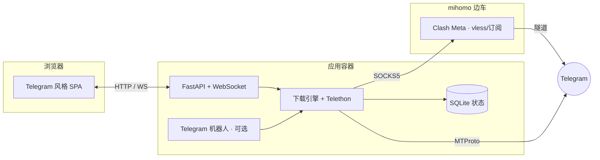

<div align="center">


<h1>Telegram Media Manager</h1>

**自托管的 Telegram 受限媒体下载器 —— 配 Telegram 风格 Web 面板。**
一条命令部署到 NAS，全部配置在浏览器里完成，断网或重启都不会丢失下载进度。

[](LICENSE)
[](https://hub.docker.com/r/gloridust/telegrammediamanager)
[](docker/Dockerfile)
[](requirements.txt)

[English](README.md) · **简体中文**

</div>

---

## 为什么做它

从受限 Telegram 频道下载媒体，通常意味着跑脚本、改 `.env`、SSH 上去盯着。**Telegram Media Manager** 把它变成一个正经的自托管应用：

- 一套仿官方客户端风格的 **Web 面板**，无需终端。
- **一条命令的 Docker** 部署，支持群晖 / QNAP / 任意 NAS，同时兼容 `amd64` 与 `arm64`。
- **断点续传** —— 中断的下载从断掉的那个字节继续，扛得住崩溃和重启。
- 内置 **mihomo（Clash Meta）代理边车** —— 贴一个 `vless`/订阅链接即可让全部流量走代理，适合 Telegram 被墙的网络。

## 功能

| | |
|---|---|
| 🖥 **Web 面板** | Telegram 风格 UI、明暗主题、移动端友好。登录、首次向导、WebSocket 实时进度。 |
| ⏯ **断点续传** | 先写入 `<name>.part`，完成后原子改名。重启安全，会主动提示恢复未完成任务。 |
| 🔗 **受限媒体** | 粘贴 `t.me` 消息链接，下载已加入频道里的单条媒体或整个相册。 |
| 📂 **整个频道** | 批量下载整个频道；持久化游标让续传不必从头重扫。 |
| 🌐 **代理就绪** | mihomo 边车支持 `vless`/订阅，或直接对接已有的 SOCKS5/HTTP 代理。 |
| 🗂 **文件管理** | 在面板里浏览/新建文件夹、切换下载目录。 |
| 🤖 **可选机器人** | 保留 Telegram 机器人用于手机端快捷控制，与面板共享同一引擎和状态。 |
| 🌍 **双语界面** | 中文 / English，登录页与设置中随时切换。 |
| 🔒 **无需 `.env`** | 首次运行全部在面板配置，保存在数据卷里。 |

## 快速开始

```bash
# 1. 获取 compose 文件
curl -O https://raw.githubusercontent.com/Gloridust/TelegramMediaManager/main/docker-compose.yml

# 2. 启动（应用 + mihomo 代理边车）
docker compose up -d

# 3. 打开面板，跟随首次向导
#    http://<你的主机>:36091
```

首次运行时向导会创建管理员账号。随后在面板中：

1. **连接 Telegram** —— 填入从 [my.telegram.org](https://my.telegram.org) 获取的 `API ID` / `API Hash`，用手机 Telegram 扫码（支持两步验证）。
2. *（可选）* **代理** —— 如需代理，粘贴订阅链接并选择节点。
3. **下载** —— 粘贴 `t.me/...` 消息或频道链接，实时查看进度。

> 没有 NAS？同样的 `docker compose up -d` 可在任何装了 Docker 的 Linux/macOS/Windows 上运行。

## 配置

**没有必填的 `.env`** —— 所有用户设置都在面板中，持久化在 `./data`。环境变量仅用于基础设施（数据目录、端口、mihomo 连接），见 [`.env.example`](.env.example) 与 [docs/configuration.md](docs/configuration.md)。

| 数据卷 | 用途 |
|---|---|
| `./data` | 全部状态：SQLite 数据库、Telegram 会话、mihomo 配置。**请备份。** |
| `./downloads` | 媒体落盘位置。通过 `DOWNLOADS_DIR` 指到你的 NAS 共享盘。 |

## 架构

一个与 UI 无关的核心同时驱动 Web API 和 Telegram 机器人，两者状态始终一致。



详见 [docs/architecture.md](docs/architecture.md)。

## 文档

- 📦 [部署](docs/deployment.md) —— NAS（群晖/QNAP）、反向代理、HTTPS、备份
- ⚙️ [配置](docs/configuration.md) —— 环境变量与面板设置
- 🌐 [代理与订阅](docs/proxy.md) —— mihomo 边车、`vless`、外部代理
- 🔒 [安全](docs/security.md) —— **暴露面板前请务必阅读**
- 🏗 [架构](docs/architecture.md) —— 各部分如何协作

## 一句话安全须知

面板可以完全控制一个**已登录的 Telegram 用户账号**。请只在内网使用，或放在带鉴权的反向代理之后 —— **切勿裸露到公网。** 详见 [docs/security.md](docs/security.md)。

## 本地开发

```bash
pip install -r requirements.txt
python main.py            # 面板运行在 http://localhost:36091
pytest -q                 # 运行测试
```

参见 [CONTRIBUTING.md](CONTRIBUTING.md)。

## 免责声明

本工具用于以你自己的账号下载**你有权访问**的媒体。你需自行遵守 Telegram 服务条款及适用法律。本项目与 Telegram 官方无关。

## 许可

[MIT](LICENSE) © Ethan Zou
