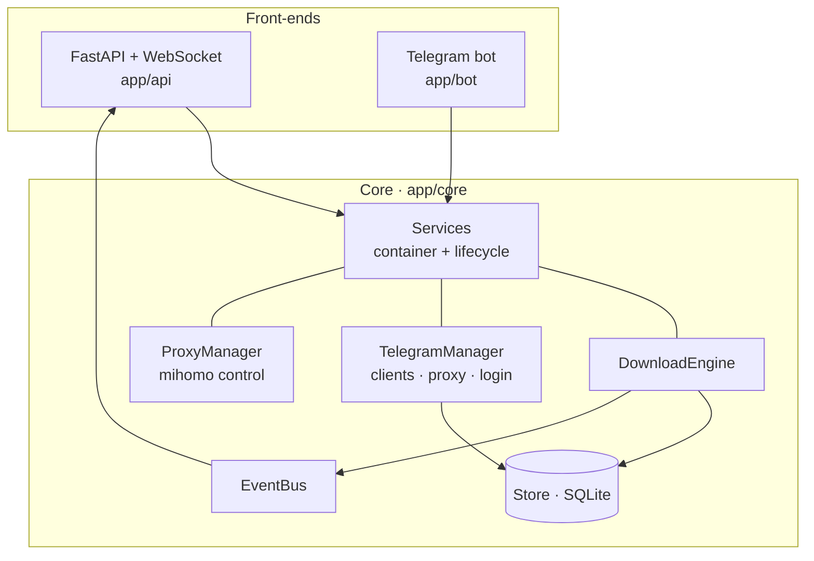

# Architecture

## Principle

A single **UI-agnostic core** owns all state and behaviour. The web API and the
Telegram bot are thin front-ends over it, so anything done in one surface is
immediately visible in the other — there is no separate "bot state" and "panel
state" to drift apart.

## Modules

| Module | Responsibility |
|---|---|
| `app/core/store.py` | SQLite persistence: jobs, channel cursors, settings, users, web sessions. WAL mode. |
| `app/core/telegram.py` | Telethon client lifecycle, proxy wiring, and the QR + 2FA login state machine the panel drives. |
| `app/core/downloader.py` | The download engine: worker pool, resumable transfers, portable paths, channel scans. |
| `app/core/proxy.py` | Thin control layer over the mihomo sidecar (config generation + REST API). |
| `app/core/events.py` | In-process pub/sub; the engine publishes, the WebSocket subscribes. |
| `app/core/services.py` | Wires everything together; owns startup/shutdown ordering. |
| `app/api/*` | REST routers + WebSocket + session auth + setup wizard. |
| `app/bot/controller.py` | Optional Telegram bot over the same engine. |
| `web/*` | Vanilla-JS single-page panel, served as static files. |

## Key mechanics

### Resumable downloads

Media streams into `<name>.part` and is renamed atomically to the final name on
completion. An interrupted `.part` is **kept**, and the next attempt resumes from
its size, aligned down to 4096 bytes — Telethon only fast-paths a download from a
4K-aligned offset, and the trailing chunk may be a partial write. This survives
crashes, network drops and restarts. Idempotent skipping keys off the file on
disk, so deleting a file is a valid way to force a re-download.

### Persistent jobs & resume

Every job is recorded before it runs. On startup (or after login) the engine
re-enqueues anything left `pending`, and the panel surfaces it. Channel scans
persist a cursor, so resuming a bulk download continues from the last message
instead of re-walking the whole history. The cursor may run ahead of what
actually finished; unfinished messages remain `pending` and are redone first, so
nothing is skipped.

### Portable paths

Folders are stored **relative to the working root** with POSIX separators, never
as absolute paths. Moving the whole download tree (new drive, remounted volume,
another machine) only requires pointing the root at the new location — unfinished
jobs relocate with it. Legacy absolute rows migrate on first run.

### Live concurrency

The worker count is adjustable at runtime. Raising it spawns workers immediately;
lowering it enqueues poison pills so surplus workers retire when idle — never
interrupting a download in progress.

### Proxy integration

`ProxyManager` generates a minimal mihomo config from the subscription (ruleset
`MATCH,PROXY`) and controls node selection through mihomo's REST API. The download
engine reaches Telegram through mihomo's local SOCKS port. See [proxy.md](proxy.md).

## Request lifecycle (a link download)

1. Panel `POST /api/downloads/link` → `DownloadEngine.download_link`.
2. The link is parsed, the entity resolved, the message (or album) fetched.
3. A job row is persisted and queued; a worker picks it up.
4. The worker streams to `.part`, emitting `job_progress` events on the bus.
5. The WebSocket relays events to the panel; the store keeps durable progress.
6. On completion the `.part` is renamed and the job marked `done`.
