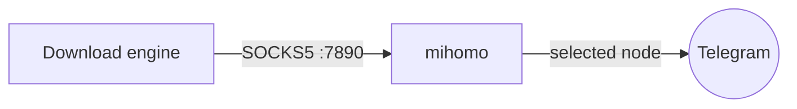

# Proxy & subscriptions

For networks where Telegram is blocked, the app can route **all** of its traffic
through a proxy. There are two ways to do that.

## How routing works

This app wants *all* of its traffic through the tunnel — it is not a whole-device
VPN. So the generated mihomo ruleset is simply `MATCH,PROXY`: no Clash-style split
routing, no per-domain rules. A subscription's only job here is to supply an
**auto-updating node list**. The app then dials mihomo's local SOCKS port, and
Telethon's MTProto connection goes through the selected node.

## Option A — mihomo sidecar with a subscription (turnkey)

The default `docker-compose.yml` already runs a **mihomo (Clash Meta)** sidecar.
We don't reimplement a proxy — mihomo handles subscription parsing and every
protocol (`vless`, `vmess`, `trojan`, `hysteria2`, `tuic`, …).

1. Panel → **代理 / Proxy**.
2. Paste your subscription URL under **订阅** and click **保存并启用**.
3. mihomo fetches and parses the nodes; the app switches its mode to the sidecar.
4. Pick a node from the list; **测速 / test** shows latency.

Under the hood the app writes `data/mihomo/config.yaml` with a `proxy-provider`
pointing at your subscription and reloads mihomo via its REST API. **刷新 /
refresh** re-pulls the subscription.

### Notes

- Clash-format subscriptions are the most widely supported; a bare `vless://`
  share link may not be a valid *subscription* — use the airport's subscription
  URL, not a single-node link.
- Proxy (`7890`) and controller (`9090`) ports are **not** published to the host
  in the default compose — only the app reaches them over the internal network.
- Set a strong `MIHOMO_SECRET` even though the ports are internal.

## Option B — an existing external proxy

Already running Clash / mihomo / a SOCKS server on your NAS or router? Skip the
subscription entirely:

1. Panel → **代理 / Proxy** → **或使用外部代理**.
2. Choose **外部代理**, set type (`SOCKS5`/`HTTP`), host, and port.
3. Save. The user client reconnects through it.

You can also disable the sidecar with `TMM_MIHOMO_ENABLED=0` and remove the
`mihomo` service from compose if you only use an external proxy.

## Applying changes

Changing the proxy reconnects the Telegram user client so it picks up the new
route. An in-progress download may be interrupted by the reconnect — but thanks
to resumable `.part` files, it simply continues from where it stopped on the next
attempt. Nothing is lost.

## Troubleshooting

| Symptom | Check |
|---|---|
| Panel shows mihomo **未连接** | Is the `mihomo` service running? `docker compose ps`. It starts after the app is healthy. |
| No nodes listed | Subscription saved? Is the URL a real subscription (not a single node)? Try **刷新**. |
| Nodes list but downloads fail | Test a node's latency; try another. Confirm the subscription isn't expired. |
| Telegram won't connect at all | Verify the proxy works outside the app; check `docker compose logs mihomo`. |
